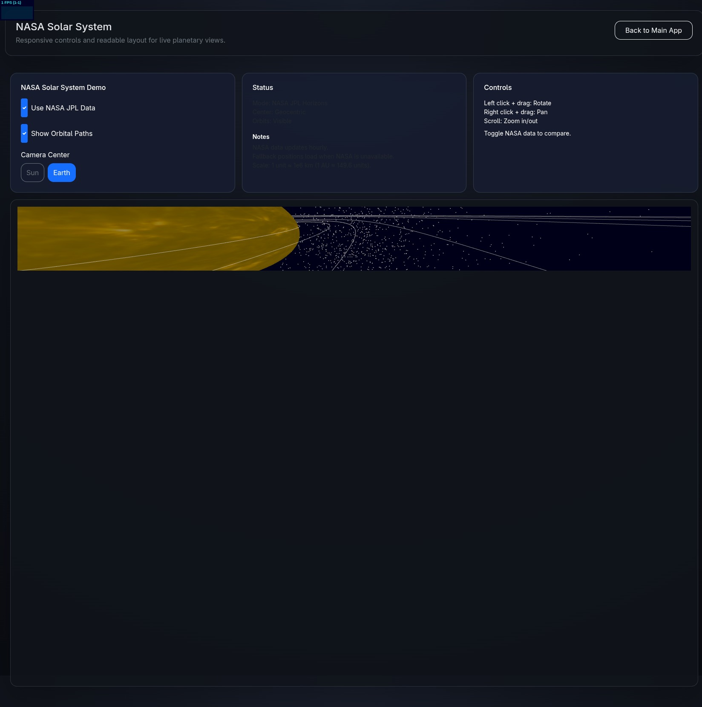
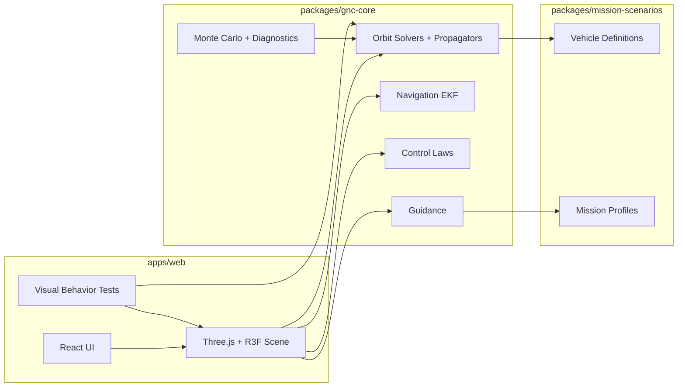
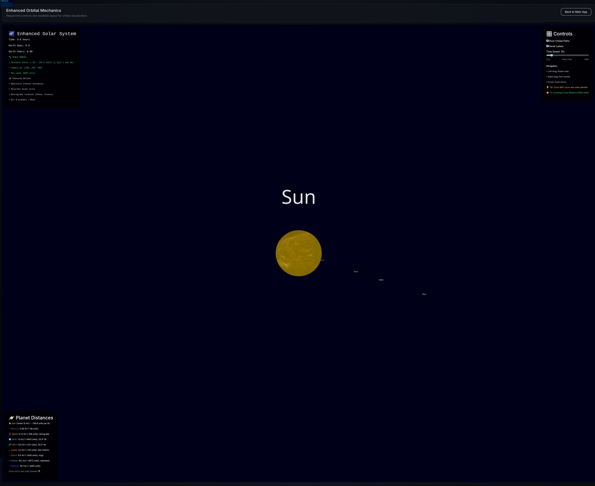
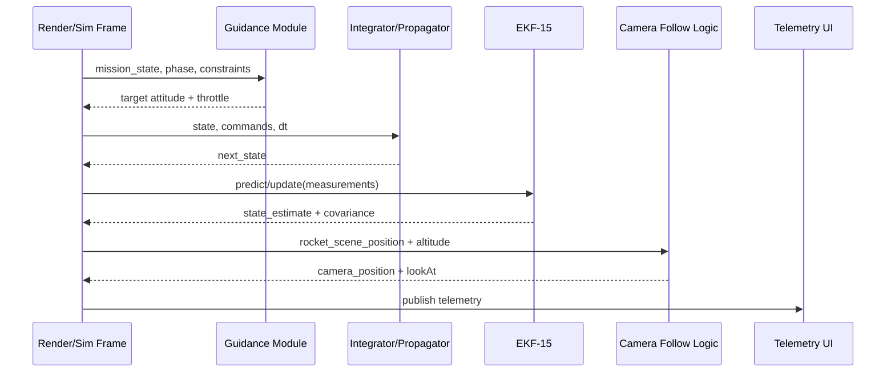
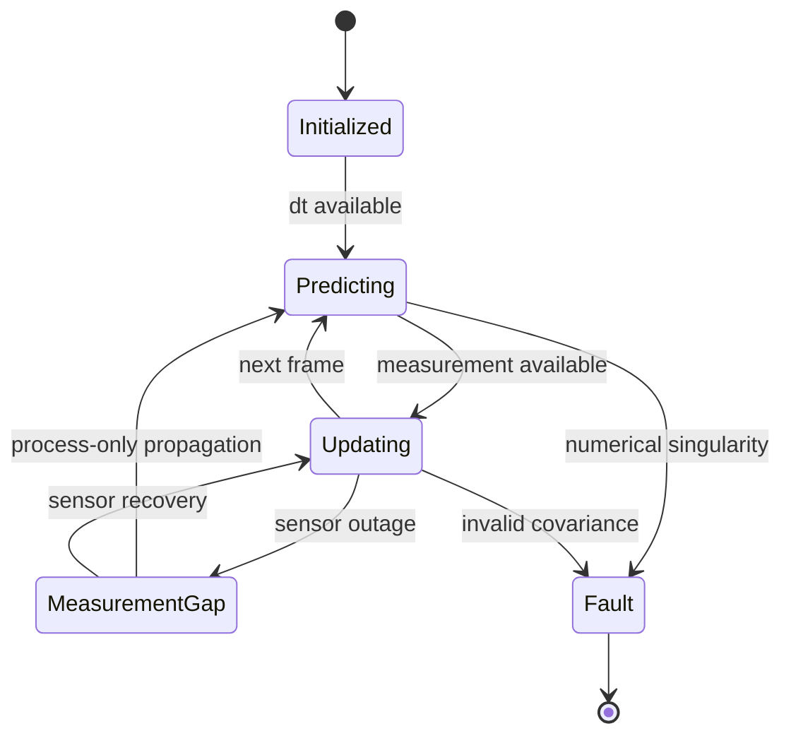
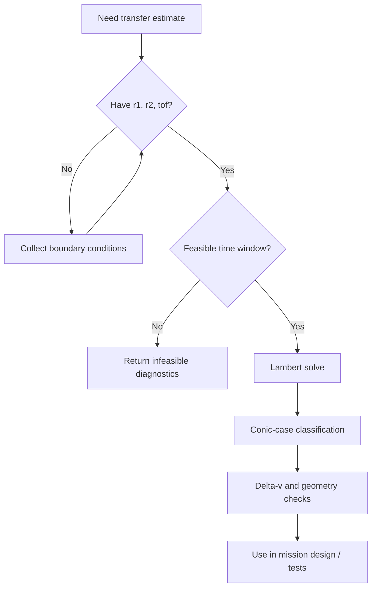
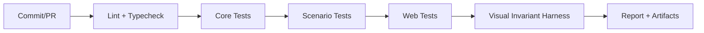
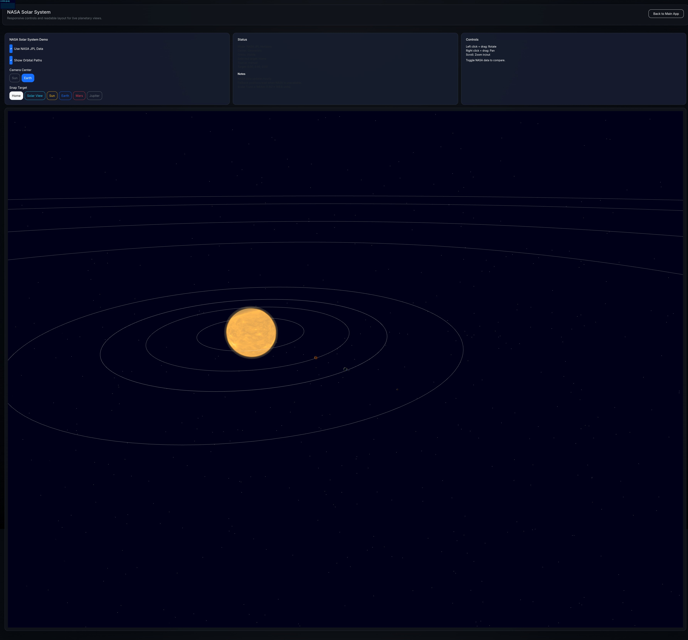
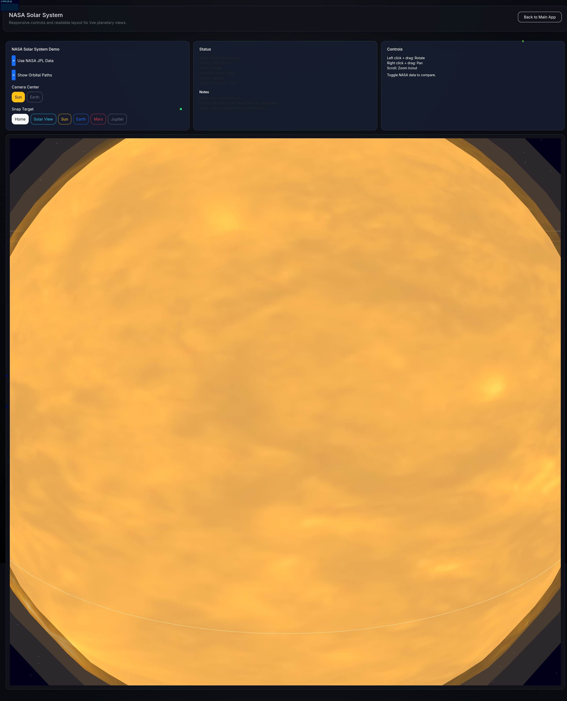

<div align="center" id="top">
  <h1>GNC Space Simulation</h1>
  <p><em>Physics-informed, browser-native Guidance, Navigation, and Control mission simulation with modern web visualization and test-driven aerospace algorithms.</em></p>
</div>

<div align="center">

[](LICENSE)
[](https://github.com/hkevin01/gnc-space-sim/commits/main)
[](https://github.com/hkevin01/gnc-space-sim/issues)
[](https://github.com/hkevin01/gnc-space-sim/pulls)
[](https://github.com/hkevin01/gnc-space-sim/stargazers)
[](https://github.com/hkevin01/gnc-space-sim/network)
[](https://www.typescriptlang.org/)
[](https://react.dev/)
[](https://threejs.org/)
[](https://vitest.dev/)
[](https://pnpm.io/)

</div>

---

## Table of Contents

- [What This Project Is](#what-this-project-is)
- [Quick Decision Tables (Use / Do Not Use)](#quick-decision-tables-use--do-not-use)
- [Feature Maturity Matrix](#feature-maturity-matrix)
- [System Architecture](#system-architecture)
- [Diagram Legend (Symbol Decoder)](#diagram-legend-symbol-decoder)
- [Monorepo Layout](#monorepo-layout)
- [Technology Stack and Why It Exists](#technology-stack-and-why-it-exists)
- [Algorithms, Equations, and Engineering Trade-offs](#algorithms-equations-and-engineering-trade-offs)
- [How the Simulation Works Step by Step](#how-the-simulation-works-step-by-step)
- [API Reference (Collapsible)](#api-reference-collapsible)
- [Testing and Validation Strategy](#testing-and-validation-strategy)
- [Installation and Local Development](#installation-and-local-development)
- [First-Week Contributor Path](#first-week-contributor-path)
- [Operational Tips and Troubleshooting](#operational-tips-and-troubleshooting)
- [Research References (NASA, Papers, arXiv)](#research-references-nasa-papers-arxiv)
- [Contributing](#contributing)
- [License](#license)

---

## What This Project Is

This repository is an end-to-end simulation platform for launch-vehicle Guidance, Navigation, and Control. It combines physically motivated algorithms, deterministic tests, and browser rendering so developers can inspect both the math and the behavior in one workflow. The codebase is intentionally split between pure algorithm packages and a visual application so numerical logic can remain testable without a rendering dependency.

The project exists for three practical reasons. First, educational simulations are most useful when they are executable and inspectable, not only descriptive. Second, GNC code tends to fail at boundaries (staging, noisy sensors, edge transfer geometry), so this project treats edge-case hardening as a first-class concern. Third, modern front-end infrastructure can now support a rich aerospace simulation loop directly in-browser, reducing setup friction for contributors.

> [!IMPORTANT]
> This is an educational and engineering-research simulation environment. It is not flight-certified software and should not be used for safety-critical operational decisions.

> [!NOTE]
> The repository prioritizes reproducible test outcomes, deterministic harnesses where practical, and explicit diagnostics for infeasible or numerically fragile scenarios.

<div align="center">
  
  <br />
  <sub>Figure 1. NASA demo Earth-centered camera capture from the running simulation, showing textured planetary rendering without rocket overlap.</sub>
</div>

> [!NOTE]
> This is a true camera-perspective screenshot from the live simulation runtime, not a raw texture asset.

> [!IMPORTANT]
> Screenshot refresh note: the current camera captures were refreshed from the live app and can be replaced again whenever the visuals change.

---

## Quick Decision Tables (Use / Do Not Use)

### 1) Capability Selection Matrix

| Capability | What It Does | Use When | Do Not Use When | Why This Distinction Matters |
|---|---|---|---|---|
| Lambert solver | Solves two-point boundary transfer velocity vectors for a chosen time-of-flight | You have start/end position vectors and need transfer injection estimates quickly | You need full-force model trajectory optimization with thrust arcs and constraints | Lambert is excellent for impulsive transfer intuition but does not model finite-burn controls by itself |
| Two-body RK4 propagation | Numerically integrates orbit states under central gravity with higher accuracy than Euler | You need stable medium-duration propagation and energy behavior suitable for regression tests | You need high-fidelity multi-body perturbations over long windows | RK4 gives a strong accuracy/runtime compromise in deterministic test pipelines |
| N-body propagation | Includes additional gravitating bodies and perturbation effects | Third-body effects, perturbation breakdown analysis, or longer mission arcs are important | You only need fast local launch-phase approximations | N-body cost is higher, but captures dynamics two-body cannot |
| EKF-15 navigation | Fuses dynamic model and noisy measurements into corrected state estimates | Sensor noise/outage handling and covariance behavior are part of system validation | Full nonlinear observability demands UKF/particle methods and highly non-Gaussian regimes | EKF is efficient and practical for many aerospace pipelines with proper tuning |
| Deterministic Monte Carlo | Runs repeatable seeded dispersion analyses | You need reproducible uncertainty regression in CI | You need random non-reproducible campaign statistics for exploratory studies | Determinism enables stable baselines and change detection |

### 2) Integrator Comparison (When to Use Which)

| Integrator | Order | Cost per Step | Typical Error Trend | Best Fit in This Repo | Not Ideal For |
|---|---:|---:|---|---|---|
| Euler | 1 | Low | Larger drift for fixed step size | Baseline comparisons and educational contrast tests | Long windows where energy stability matters |
| RK4 | 4 | Medium | Much lower truncation error for same step | Default two-body path and benchmarked propagation | Very stiff dynamics requiring implicit methods |
| Adaptive variable-step (future option) | Varies | Variable | Better local control under changing dynamics | Potential future high-fidelity mission studies | Cases demanding deterministic fixed-step reproducibility |

### 3) Guidance / Navigation / Control Role Separation

| Subsystem | Core Question It Answers | Primary Inputs | Primary Outputs | Failure Mode if Missing |
|---|---|---|---|---|
| Guidance | Where should the vehicle go next? | Mission objectives, phase, constraints | Reference attitude/throttle profile | Vehicle can remain stable but miss mission geometry |
| Navigation | Where is the vehicle now? | Sensor measurements + process model | Estimated state and covariance | Guidance/control act on wrong state assumptions |
| Control | How should we actuate now? | Guidance command + estimated state | Actuator-level corrections | Commands remain theoretical and unexecuted |

### 4) Practical Mission Window Behavior Checks

| Window | Typical Time Span | Expected Behavior | Invariant to Assert | Common Regression Caught |
|---|---|---|---|---|
| Pad to early ascent | 0s to ~60s | Rapid acceleration, low altitude | Finite rocket scene vectors, positive mass, valid camera target | Bad coordinate scaling and camera NaN vectors |
| Mid ascent | ~60s to ~300s | Increasing altitude/velocity, dynamic attitude | Monotonic camera-distance tiers by altitude bins | Broken camera schedule thresholds |
| Upper ascent / handoff | ~300s to ~650s | High velocity, long path arc | No invalid vectors in follow camera outputs | Drift from numerical instability or transform mismatches |

> [!TIP]
> Near the top of your workflow, decide whether a task is “visual confidence” or “physics confidence.” Visual confidence relies on camera/position invariants, while physics confidence requires propagator and estimator checks with strict numeric tolerances.

---

## Feature Maturity Matrix

This matrix gives a practical snapshot of where each major module stands today. Stable modules are expected to be safe for routine use and extension, experimental modules are actively evolving and may change interfaces more frequently, and planned modules describe intended future capability that is not yet complete.

Use this section before selecting work for a milestone, because it helps contributors choose changes that match their risk tolerance and available review bandwidth. For example, contributors who want low-friction onboarding should prefer stable modules, while contributors exploring performance or advanced mission methods may choose experimental or planned tracks.

| Module / Area | Status | What It Currently Supports | What Is Still Missing | Recommended Contribution Type |
|---|---|---|---|---|
| Launch guidance profile and mission-phase wiring | Stable | Phase-aware ascent references and mission flow integration | Broader mission families beyond baseline profiles | Refinement, docs, regression tests |
| Lambert solver with diagnostics and conic classification | Stable | Transfer solve, infeasible-time diagnostics, failure reason outputs | Extended validation against larger benchmark catalogs | Validation tests and edge-case hardening |
| Two-body propagation default path (RK4) | Stable | Accurate fixed-step propagation baseline and regression behavior | Adaptive-step mode for advanced studies | Numerical benchmark additions |
| EKF-15 with outage and Jacobian coupling coverage | Stable | Predict/update flow, outage recovery behavior, covariance checks | Expanded measurement model variants | Sensor-model extensions and tests |
| N-body propagation and perturbation breakdown | Stable | Multi-body acceleration modeling and perturbation reporting | Additional scenario baselines and long-window profiling | Scenario validation and profiling |
| Deterministic Monte Carlo engine | Stable | Seeded repeatability and summary statistics | Richer multidimensional campaign reporting | Analysis tooling and report formatting |
| Web visual behavior harness (camera and rocket invariants) | Stable | Headless invariant assertions across mission windows | Optional image/snapshot layer for presentation QA | Test expansion and contributor docs |
| NASA body fallback rendering completeness | Stable | Required-body fallback when upstream data is partial | Additional fallback policies for degraded feeds | Reliability and UX messaging updates |
| Rust/WASM numerical kernels | Experimental | Initial scaffolding for high-performance computation path | Broader algorithm parity and production integration | Performance experiments and interface prototyping |
| Advanced optimization-based transfer stack (direct methods) | Planned | Conceptual direction and references in docs | Implementation, benchmark suites, interfaces | Design proposals and prototype branches |
| Real-time uncertainty visualization overlays | Planned | Conceptual alignment with Monte Carlo outputs | UI layer, statistical rendering semantics | UI design and data-contract proposals |

> [!IMPORTANT]
> “Stable” in this matrix means stable in this repository context and test suite, not certified for mission operations.

---

## System Architecture

The architecture intentionally isolates core aerospace math from the user interface. That separation keeps algorithms reusable and testable in headless environments while the React/Three.js app focuses on rendering, interaction, and telemetry presentation.

### 1) High-Level Package Interaction


```mermaid
flowchart LR
  subgraph Web[apps/web]
    UI[React UI]
    Scene[Three.js + R3F Scene]
    Harness[Visual Behavior Tests]
  end

  subgraph Core[packages/gnc-core]
    Guidance[Guidance]
    Nav[Navigation EKF]
    Control[Control Laws]
    Orbit[Orbit Solvers + Propagators]
    Analysis[Monte Carlo + Diagnostics]
  end

  subgraph Scenarios[packages/mission-scenarios]
    Vehicles[Vehicle Definitions]
    Missions[Mission Profiles]
  end

  UI --> Scene
  Scene --> Guidance
  Scene --> Orbit
  Scene --> Nav
  Scene --> Control
  Guidance --> Missions
  Orbit --> Vehicles
  Analysis --> Orbit
  Harness --> Scene
  Harness --> Orbit
```

<div align="center">
  
  <br />
  <sub>Figure 2. Enhanced orbital mechanics camera view from the running scene, showing dynamic planetary context.</sub>
</div>

> [!NOTE]
> In the running simulation, this asset anchors the broader solar-system context so contributors can visually relate launch and transfer behavior to planetary geometry.

### 2) Launch Loop and Data Path


```mermaid
sequenceDiagram
  participant Frame as Render/Sim Frame
  participant Guidance as Guidance Module
  participant Dynamics as Integrator/Propagator
  participant Nav as EKF-15
  participant Cam as Camera Follow Logic
  participant UI as Telemetry UI

  Frame->>Guidance: mission_state, phase, constraints
  Guidance-->>Frame: target attitude + throttle
  Frame->>Dynamics: state, commands, dt
  Dynamics-->>Frame: next_state
  Frame->>Nav: predict/update(measurements)
  Nav-->>Frame: state_estimate + covariance
  Frame->>Cam: rocket_scene_position + altitude
  Cam-->>Frame: camera_position + lookAt
  Frame->>UI: publish telemetry
```

### 3) Navigation Estimate State Machine


```mermaid
stateDiagram-v2
  [*] --> Initialized
  Initialized --> Predicting: dt available
  Predicting --> Updating: measurement available
  Updating --> Predicting: next frame
  Updating --> MeasurementGap: sensor outage
  MeasurementGap --> Predicting: process-only propagation
  MeasurementGap --> Updating: sensor recovery
  Predicting --> Fault: numerical singularity
  Updating --> Fault: invalid covariance
  Fault --> [*]
```

### 4) Transfer-Solver Decision Graph


```mermaid
flowchart TD
  Start[Need transfer estimate] --> Inputs{Have r1, r2, tof?}
  Inputs -- No --> Collect[Collect boundary conditions]
  Collect --> Inputs
  Inputs -- Yes --> Feasible{Feasible time window?}
  Feasible -- No --> Diagnose[Return infeasible diagnostics]
  Feasible -- Yes --> Solve[Lambert solve]
  Solve --> Classify[Conic-case classification]
  Classify --> Validate[Delta-v and geometry checks]
  Validate --> Done[Use in mission design / tests]
```

### 5) CI and Quality Flow


```mermaid
flowchart LR
  A[Commit/PR] --> B[Lint + Typecheck]
  B --> C[Core Tests]
  C --> D[Scenario Tests]
  D --> E[Web Tests]
  E --> F[Visual Invariant Harness]
  F --> G[Report + Artifacts]
```

---

## Diagram Legend (Symbol Decoder)

This section translates common symbols and shorthand used in the architecture and algorithm diagrams so contributors without aerospace background can read them quickly. The goal is to remove ambiguity when a diagram uses compact labels such as EKF, state vectors, or transfer-solver notation.

If a symbol is unclear while you are reviewing a change, update this legend in the same pull request. Keeping these mappings current is one of the fastest ways to make the repository easier for new contributors.

| Symbol / Term | Meaning | Where You See It | Why It Matters |
|---|---|---|---|
| r1, r2 | Initial and final position vectors | Lambert decision and transfer flow diagrams | Defines boundary conditions for transfer solve |
| tof | Time of flight | Transfer-solver decision graph | Determines feasibility and solution branch |
| EKF | Extended Kalman Filter | Navigation flow and state-machine diagrams | Core estimator for noisy measurements |
| dt | Simulation time step | Launch loop and integrator pathways | Controls propagation resolution and stability |
| state_estimate | Filtered vehicle state | Navigation and telemetry flow | Drives control and display decisions |
| covariance (P) | Estimated uncertainty matrix | EKF predict/update equations and nav logic | Quantifies confidence in the estimate |
| guidance command | Desired attitude/throttle target | Launch loop sequence diagram | Connects mission intent to control action |
| conic case | Orbit class interpretation for transfer | Lambert diagnostics outputs | Helps classify transfer geometry behavior |
| perturbation breakdown | Contribution split by force source | N-body analysis outputs | Explains why trajectories diverge from two-body paths |
| visual invariant harness | Deterministic render-behavior assertions | Web test pipeline and QA flow diagrams | Catches camera/scene regressions without manual inspection |

### Diagram Reading Tips

- In flowcharts, boxes typically represent computations and diamonds represent decision points.
- In sequence diagrams, each vertical lane is a subsystem and each arrow is information transfer over one frame or event.
- In state diagrams, transitions describe when the estimator or simulation mode changes under specific conditions.

> [!NOTE]
> “Vector” means a directional quantity with magnitude and direction, while “scalar” means a single magnitude value. Many bugs come from accidentally mixing these two concepts.

---

## Monorepo Layout

### 5) Package and Responsibility Table

| Package | Role | Contains | Why It Exists Separately |
|---|---|---|---|
| apps/web | Browser application | React UI, Three scene, visual harness tests | Keeps UI concerns isolated from math kernels |
| packages/gnc-core | Algorithmic core | Lambert, RK4, EKF-15, Monte Carlo, n-body, utilities | Enables headless testing and reusable scientific logic |
| packages/mission-scenarios | Mission and vehicle definitions | Stage masses, mission events, profile configs | Decouples scenario data from reusable algorithms |
| packages/ui-components | Shared UI primitives | Common visual components | Prevents duplication across front-end surfaces |
| packages/gnc-rust | Performance experiments | Rust numerical kernels, wasm bridge | Supports future speedups in heavy integration loops |

### 6) Folder-Level Navigation Guide

| Path | What You Will Find | Start Here If You Need | Typical Contributor |
|---|---|---|---|
| apps/web/src/components | Scene objects, launch demo, camera logic | Visual bugs, rendering behavior, camera follow | Front-end + simulation integrator |
| apps/web/src/__tests__ | Browser-side behavior and utility tests | Visual regression harness and rendering invariants | QA-focused contributor |
| packages/gnc-core/src/orbits | Solvers and propagators | Transfer math, orbit integration, perturbation studies | Astrodynamics contributor |
| packages/gnc-core/src/navigation | EKF and sensor pathways | Estimator tuning, outage behavior, covariance checks | Navigation contributor |
| packages/gnc-core/src/analysis | Monte Carlo and summary tools | Repeatable uncertainty campaigns | Systems analysis contributor |
| documentation | Design notes and rationale docs | Deeper conceptual background | Any contributor onboarding |

> [!NOTE]
> Keeping orbit and estimator logic in packages instead of the web app prevents accidental coupling to rendering frame rate, which is a common source of hidden numerical bugs.

---

## Technology Stack and Why It Exists

The stack is selected to optimize for correctness, maintainability, and contributor throughput. TypeScript provides compile-time defense against unit and shape mismatch errors. React plus React Three Fiber provide a practical, composable way to render mission states while still integrating deeply with simulation outputs. Vitest and pnpm workspaces give fast feedback loops and clean package boundaries for monorepo development.

### 7) Stack Trade-Off Table

| Technology | Purpose in Project | Why Chosen | Alternative Considered | Why Alternative Was Not Primary |
|---|---|---|---|---|
| TypeScript | Strong static contracts across simulation/data interfaces | Reduces unit confusion and catches shape errors early | Plain JavaScript | Too permissive for physics-heavy code paths |
| React + R3F | Real-time scene and telemetry UI | Mature ecosystem and excellent WebGL integration | Raw Three.js | More imperative boilerplate and less composability |
| Vitest | Fast unit/integration tests | Native Vite integration and fast startup | Jest | Higher transform overhead in this repo setup |
| pnpm workspaces | Monorepo dependency graph | Fast installs and strict linking behavior | npm workspaces | Less strict and less efficient in large monorepos |
| Docker tooling | Reproducible local/dev container workflows | Consistent environment across machines | Host-only setup | Greater environment drift risk |

---

## Algorithms, Equations, and Engineering Trade-offs

This project chooses algorithms that are both instructive and practical in a browser-native engineering workflow. The emphasis is not only on obtaining plausible trajectories but on producing debuggable diagnostics and repeatable tests under edge conditions. Where possible, algorithm choices are paired with explicit reasons and alternatives so contributors can understand decision boundaries.

### 8) Algorithm Choice Table (What, Why, and Why Not Others)

| Algorithm | What It Does | Formula / Model Focus | Why Chosen Here | Why Not the Main Alternative |
|---|---|---|---|---|
| Lambert universal-variable solver | Computes transfer velocities between boundary positions at a target time-of-flight | Solves boundary-value conditions under two-body assumptions | Fast transfer feasibility checks with diagnostic output | Full direct transcription optimization is heavier for routine CI tests |
| RK4 propagation | Numerically integrates state dynamics with fourth-order local accuracy | Repeated slope evaluation over sub-steps | Better error/energy behavior than Euler for similar fixed step workflows | Symplectic methods are excellent for very long horizons but more complex for current mixed workloads |
| EKF-15 | Estimates state/covariance under noisy measurements and process dynamics | Linearized covariance propagation and correction updates | Balance of performance and observability handling in practical aerospace pipelines | UKF/particle filters are more expensive and require more tuning for this baseline |
| Deterministic Monte Carlo | Runs seeded scenario perturbations reproducibly | Controlled pseudo-random sampling | CI-friendly reproducibility and comparative analysis across commits | Non-seeded random campaigns are harder to baseline in regression suites |
| N-body perturbation analysis | Includes third-body and perturbation influences | Summation of gravitational accelerations across bodies | Needed for scenario validation beyond strict two-body simplifications | Two-body only cannot represent important transfer perturbation effects |

### Core Equations Used

The simulation applies a mixture of classical astrodynamics and state-estimation equations:

1. Two-body acceleration model:

$$
\mathbf{a} = -\mu \frac{\mathbf{r}}{\lVert \mathbf{r} \rVert^3}
$$

2. Discrete-time EKF covariance predict/update pattern:

$$
\mathbf{P}_{k|k-1} = \mathbf{F}_k \mathbf{P}_{k-1|k-1} \mathbf{F}_k^\top + \mathbf{Q}_k
$$

$$
\mathbf{K}_k = \mathbf{P}_{k|k-1}\mathbf{H}_k^\top\left(\mathbf{H}_k\mathbf{P}_{k|k-1}\mathbf{H}_k^\top + \mathbf{R}_k\right)^{-1}
$$

$$
\mathbf{x}_{k|k} = \mathbf{x}_{k|k-1} + \mathbf{K}_k\left(\mathbf{z}_k - \mathbf{H}_k\mathbf{x}_{k|k-1}\right)
$$

3. Launch azimuth geometric relationship used in guidance derivation:

$$
\beta = \arcsin\left(\frac{\cos i}{\cos \phi}\right)
$$

<div align="center">
  
  <br />
  <sub>Figure 3. NASA solar-system mode wide camera view captured in-app, used to document runtime body-position visualization.</sub>
</div>

> [!NOTE]
> This visual context is especially useful when validating mission windows that include translunar phases, because contributors can quickly correlate trajectory behavior with mission intent.

### 9) Formula-to-Subsystem Mapping Table

| Formula | Used In | Why Needed | If Removed |
|---|---|---|---|
| Two-body acceleration | Propagators and baseline orbital dynamics | Supplies physically meaningful central gravity evolution | Position and velocity become physically inconsistent |
| EKF predict/update equations | Navigation estimation | Fuses noisy observations with modeled dynamics | Guidance/control consume raw noisy states |
| Launch azimuth relationship | Initial ascent guidance | Aligns trajectory inclination targets with launch site geometry | Early heading can be physically invalid for mission target |

> [!IMPORTANT]
> Numerical methods are chosen to be understandable and testable first. More sophisticated methods can be added, but the repository defaults to approaches that support deterministic regression and clear diagnostics.

---

## How the Simulation Works Step by Step

A single simulated mission frame can be understood as a small pipeline. Guidance computes desired behavior from mission phase and current state. Dynamics advances the physical state based on vehicle and environment parameters. Navigation corrects state confidence with sensor information. Rendering then maps state into scene coordinates, and camera logic chooses stable and readable viewpoints.

1. Build current mission context (phase, remaining propellant, target profile).
2. Compute guidance outputs (attitude/throttle references).
3. Integrate vehicle state for the frame interval.
4. Update navigation estimate using available measurements.
5. Transform physical vectors into scene coordinates.
6. Compute camera target and distance schedule.
7. Publish telemetry and render.

### 10) Step-by-Step Signal Contract Table

| Step | Input Contract | Output Contract | Why This Contract Is Important |
|---|---|---|---|
| Guidance | State + mission profile | Command references | Prevents ad-hoc control behavior between mission phases |
| Dynamics integration | Prior state + commands + dt | Physically advanced state | Maintains continuity and conservation expectations |
| Navigation update | Predicted state + measurements | Corrected estimate + covariance | Controls and telemetry rely on estimate quality |
| Scene transform | Physical state vectors | Scene-space vectors | Avoids scale/offset ambiguity in visual layer |
| Camera logic | Scene position + altitude | Camera pose/look target | Keeps operator context during fast dynamics |

---

## API Reference (Collapsible)

<details>
<summary>Core orbital and transfer APIs</summary>

| API | Package Path | Purpose | Typical Inputs | Typical Outputs |
|---|---|---|---|---|
| lambert | packages/gnc-core/src/orbits/lambert.ts | Boundary-value transfer solve with diagnostics | r1, r2, tof, mu | velocity vectors, conic case, failure diagnostics |
| propagateTwoBody | packages/gnc-core/src/orbits/rk4.ts | Two-body propagation with selectable mode | state0, dt, steps, mode | propagated trajectory/state history |
| nbodyPropagate | packages/gnc-core/src/orbits/nbody.ts | Multi-body integration with perturbation accounting | initial state, body set, dt | evolved state + perturbation breakdown |

```ts
// Example shape only; check source for exact typing.
const result = propagateTwoBody(initialState, {
  dt: 1,
  steps: 1200,
  mode: 'rk4',
})
```

</details>

<details>
<summary>Navigation and analysis APIs</summary>

| API | Package Path | Purpose | Typical Inputs | Typical Outputs |
|---|---|---|---|---|
| EKF15.predict / EKF15.updateGPS | packages/gnc-core/src/navigation/ekf15.ts | Estimate state and covariance under process/sensor models | state estimate, covariance, measurement | updated estimate + covariance |
| runMonteCarlo | packages/gnc-core/src/analysis/monte_carlo.ts | Deterministic seeded dispersion campaigns | seed, sample count, callback model | distribution samples and summaries |
| summarize | packages/gnc-core/src/analysis/monte_carlo.ts | Aggregate statistical outputs | sample array | min/mean/max/std style summaries |

```ts
// Example shape only; check source for exact typing.
const mc = runMonteCarlo({
  seed: 42,
  samples: 200,
  simulate: (rng) => model(rng),
})
```

</details>

<details>
<summary>Web visual behavior utility APIs</summary>

| API | Path | Purpose | Typical Usage |
|---|---|---|---|
| rocketScenePositionFromR | apps/web/src/utils/launchVisualBehavior.ts | Converts physical state vector to scene coordinates | called each simulation update before rendering |
| cameraDistanceForAltitudeKm | apps/web/src/utils/launchVisualBehavior.ts | Computes altitude-tier camera distance | used in follow-camera schedule |
| followCameraTarget | apps/web/src/utils/launchVisualBehavior.ts | Produces camera position and look target | used by launch camera follow logic |
| isValidRocketScenePosition | apps/web/src/utils/launchVisualBehavior.ts | Guard against invalid vectors | used in visual invariant tests |

```ts
// Example shape only; check source for exact typing.
const rocketPos = rocketScenePositionFromR(state.r)
const cam = followCameraTarget(rocketPos, altitudeKm)
```

</details>

> [!TIP]
> Keep visual utility functions pure and deterministic. This makes them easy to test in headless mode and keeps production camera behavior aligned with test assertions.

---

## Testing and Validation Strategy

Validation is treated as a layered pipeline rather than a single pass/fail gate. Core algorithms are verified in package-level tests with deterministic assertions and edge-case diagnostics. Scenario packages validate mission profile consistency. Web tests ensure rendering and camera behavior remain stable, including practical mission-window invariants that avoid manual visual inspection.

### 11) Validation Layers Table

| Layer | Scope | Typical Assertion Type | Why It Exists |
|---|---|---|---|
| Unit tests (core) | Individual algorithms and helpers | Numeric tolerances, diagnostic reasons, edge handling | Prevent silent math regressions |
| Integration tests (scenarios) | Multi-module mission logic | Event ordering, mission profile consistency | Catch cross-module assumption mismatches |
| Web behavior tests | UI-linked simulation outputs | Finite vectors, camera invariants, scene mapping checks | Catch visual/transform regressions early |
| Workspace typecheck/lint | Entire monorepo | Static contracts and style constraints | Enforce maintainable interfaces |

### 12) Regression Signals and Expected Meanings

| Signal | Likely Cause | First Place to Inspect |
|---|---|---|
| Camera vector becomes NaN | Scene transform mismatch or invalid state propagation | launch visual behavior utilities and launch demo wiring |
| Transfer test switches to infeasible unexpectedly | Lambert diagnostics threshold or geometry edge | lambert solver and corresponding diagnostics output |
| Energy drift jump in benchmark | Integrator mode/path regression | rk4/euler benchmark tests and two-body default path |
| EKF covariance grows without recovery | Measurement update path or Jacobian issue | EKF predict/update implementation and outage-mode tests |

---

## Installation and Local Development

The project is optimized for local Node workflows and can also run in containerized environments for consistent onboarding. Use pnpm workspaces at the repository root so all packages are installed and resolved correctly.

### Prerequisites

- Node.js 20+
- pnpm 9+
- Docker (optional)

### Setup

```bash
git clone https://github.com/hkevin01/gnc-space-sim.git
cd gnc-space-sim
pnpm install
```

### Common Commands

```bash
# Run all tests
pnpm -r test

# Run full type checks
pnpm -r typecheck

# Start web app
pnpm --filter @gnc/web dev

# Run only web tests
pnpm --filter @gnc/web test
```

> [!NOTE]
> If you are changing algorithms and visuals together, run both core and web tests in the same iteration. This catches coordinate-map regressions that pure core tests cannot see.

---

## First-Week Contributor Path

This path is designed to help a new contributor become productive in the first week without guessing where to start. The checklist emphasizes small, reviewable tasks that build familiarity with architecture, testing discipline, and module boundaries before deeper algorithm changes.

Estimated effort assumes a contributor who is comfortable with TypeScript and basic Git workflows. If you are new to astrodynamics, the same path still works, but plan extra reading time in the references section and focus on test-first tasks before touching core math.

| Day / Milestone | Task | Estimated Effort | Output / Definition of Done |
|---|---|---:|---|
| Day 1 | Set up workspace, run tests and typechecks | 1.0 to 1.5 hours | Local environment validated and baseline command set recorded |
| Day 1 to Day 2 | Read architecture, stack, and algorithm sections in README + docs | 1.5 to 2.5 hours | Clear mental map of package boundaries and simulation loop |
| Day 2 | Pick one stable module and trace one end-to-end test path | 1.0 to 2.0 hours | Short notes on input/output contracts and key invariants |
| Day 3 | Submit a docs or small test-improvement PR | 1.5 to 3.0 hours | First merged contribution with CI passing |
| Day 4 | Add one edge-case test in core or web harness | 2.0 to 4.0 hours | Regression test demonstrating a real guardrail |
| Day 5 | Pair one code improvement with rationale notes | 2.0 to 4.0 hours | Small implementation PR with explanation of why/impact |

### First-Week Checklist

- [ ] Run `pnpm -r test` and `pnpm -r typecheck` successfully.
- [ ] Read the maturity matrix and pick one stable area to start.
- [ ] Read at least one algorithm section and one corresponding test file.
- [ ] Open one issue comment or discussion question with a concrete proposal.
- [ ] Submit one small PR with passing checks.
- [ ] Add or improve at least one test assertion tied to a known invariant.

### Good First Task Categories

| Category | Examples | Why It Is Good for Week 1 |
|---|---|---|
| Documentation precision | Clarify assumptions, add symbol explanations, improve setup notes | Low risk and high leverage for future contributors |
| Test hardening | Add edge-case assertions for diagnostics and invariants | Builds confidence in regression discipline |
| Small refactors in stable modules | Extract pure helper, reduce duplication, improve naming | Teaches architecture without large behavioral risk |
| Developer experience improvements | Script clarity, command docs, troubleshooting notes | Improves onboarding speed for everyone |

> [!TIP]
> If you are unsure between two tasks, choose the one that adds or strengthens a test. It creates durable value even when implementation details evolve.

---

## Operational Tips and Troubleshooting

### 13) Practical Tips Table

| Scenario | Recommended Action | Why |
|---|---|---|
| You changed camera follow logic | Run visual-behavior utility tests and launch behavior tests first | Camera regressions often appear as finite/target issues before visual artifacts |
| You changed transfer logic | Run lambert and orbit test groups with diagnostics enabled | Failure reason mismatches are often more informative than raw delta-v mismatches |
| You changed EKF tuning | Run outage and recovery tests with deterministic seeds | Prevents intermittent filter behavior and unstable covariance growth |
| You changed package exports | Run workspace typecheck before tests | Catch symbol collisions and export-surface regressions early |

<div align="center">
  
  <br />
  <sub>Figure 4. NASA demo Sun-centered camera capture from the running simulation, highlighting textured solar rendering.</sub>
</div>

> [!NOTE]
> Even when a mission profile does not target Mars directly, keeping this body visible in the scene helps test rendering stability, asset fallback behavior, and cross-body scaling consistency.

> [!WARNING]
> Avoid blending rendering-side scaling constants with algorithm-side physical constants. Keep conversion boundaries explicit so units remain auditable.

> [!CAUTION]
> Large simulation time multipliers can hide step-size stability problems. For correctness checks, prefer stable deterministic dt settings and then evaluate visualization smoothness separately.

---

## Research References (NASA, Papers, arXiv)

The following references are useful for understanding why these modeling choices are reasonable and where future improvements may come from. They include classical astrodynamics texts, practical state-estimation references, and arXiv papers relevant to transfer and optimization methods.

1. D. A. Vallado, *Fundamentals of Astrodynamics and Applications*, 4th ed.
2. R. H. Battin, *An Introduction to the Mathematics and Methods of Astrodynamics*, AIAA.
3. M. D. Shuster, “A Survey of Attitude Representations,” *Journal of the Astronautical Sciences*.
4. D. Izzo, “Revisiting Lambert’s Problem,” arXiv:1403.2705, 2014. https://arxiv.org/abs/1403.2705
5. S. J. Julier and J. K. Uhlmann, “Unscented Filtering and Nonlinear Estimation,” *Proceedings of the IEEE*, 2004.
6. G. Welch and G. Bishop, “An Introduction to the Kalman Filter,” UNC technical report.
7. E. Hairer, C. Lubich, and G. Wanner, *Geometric Numerical Integration*.
8. J. Betts, *Practical Methods for Optimal Control and Estimation Using Nonlinear Programming*.
9. J. T. Conway (ed.), *Spacecraft Trajectory Optimization*.
10. NASA SP and mission documentation for SLS/Artemis public mission profiles.

> [!TIP]
> If you are extending the solver stack, add a short “why this method” note and at least one citation in the relevant module docs so future contributors can evaluate trade-offs quickly.

---

## Contributing

Contributions are welcome across algorithms, tests, rendering, and documentation. For code changes, favor small focused pull requests with deterministic tests and clear rationale. For algorithm changes, explain what changed mathematically, why it improves behavior, and what regression tests were added.

Before opening a pull request:

1. Run test suites relevant to changed packages.
2. Run workspace type checks.
3. Update documentation if behavior or interfaces changed.
4. Include edge-case notes when touching solver or estimator internals.

See CONTRIBUTING.md for repository conventions.

---

## License

This repository is licensed under the terms described in LICENSE.

<p align="right">(<a href="#top">back to top</a>)</p>
