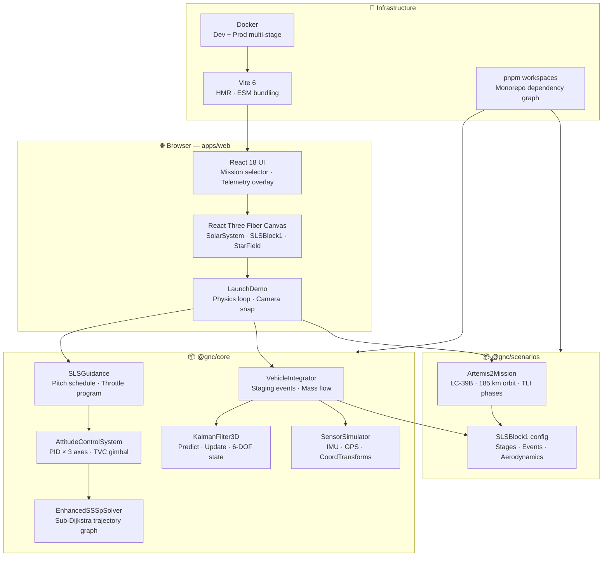
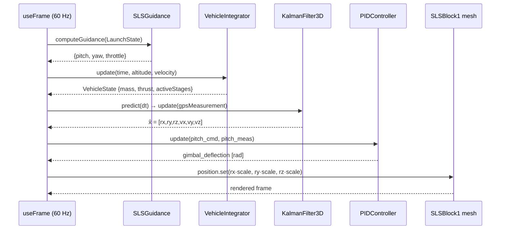
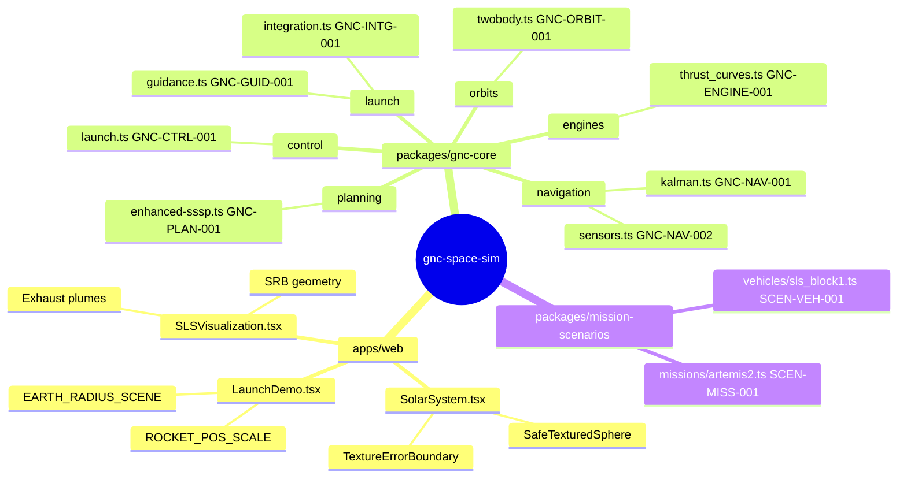
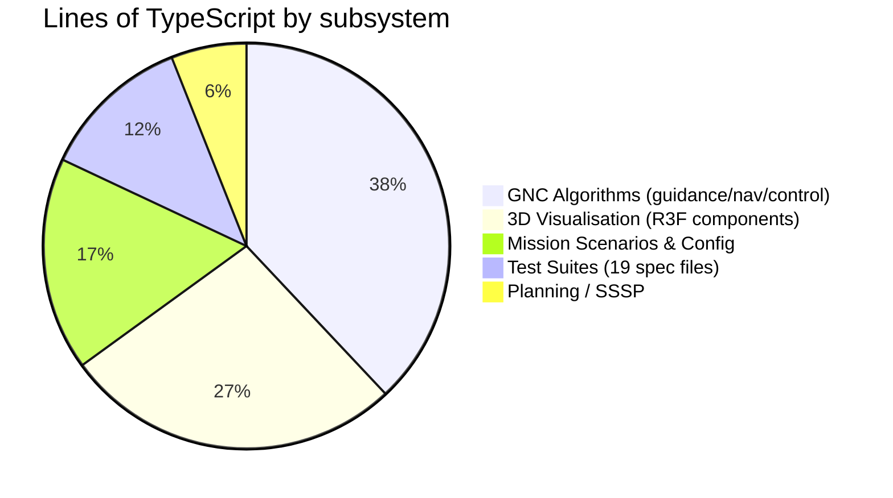
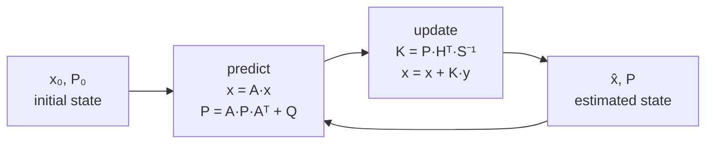
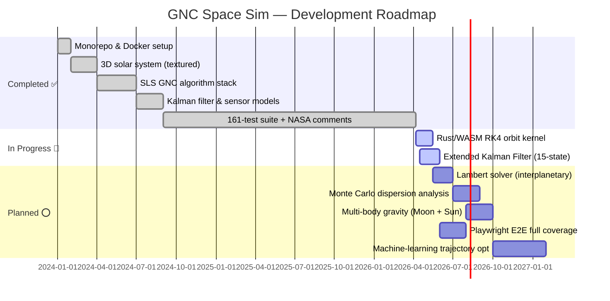

<div align="center" id="top">
  <h1>🛸 GNC Space Simulation</h1>
  <p><em>Physics-accurate, browser-native Guidance, Navigation & Control simulation of the NASA SLS Block 1 and beyond — powered by React Three Fiber, Vitest, and a full GNC algorithm stack.</em></p>
</div>

<div align="center">

[](LICENSE)
[](https://github.com/hkevin01/gnc-space-sim/stargazers)
[](https://github.com/hkevin01/gnc-space-sim/network)
[](https://github.com/hkevin01/gnc-space-sim/commits/main)
[](https://github.com/hkevin01/gnc-space-sim)
[](https://github.com/hkevin01/gnc-space-sim/issues)
[](https://typescriptlang.org)
[](https://react.dev)
[](https://threejs.org)
[](https://vitest.dev)
[](https://pnpm.io)

</div>

---

## Table of Contents

- [Overview](#-overview)
- [Key Features](#-key-features)
- [Architecture](#-architecture)
- [Monorepo Structure](#-monorepo-structure)
- [Technology Stack](#-technology-stack)
- [Setup & Installation](#-setup--installation)
- [Usage](#-usage)
- [GNC Algorithm Details](#-gnc-algorithm-details)
- [Test Suite](#-test-suite)
- [Roadmap](#-roadmap)
- [Contributing](#-contributing)
- [License & Acknowledgements](#-license--acknowledgements)

---

## 🎯 Overview

**GNC Space Simulation** is a monorepo containing a complete Guidance, Navigation & Control engine for launch vehicles, paired with a real-time 3D solar system visualiser running entirely in the browser. It simulates a full SLS Block 1 / Artemis II mission profile — from liftoff at LC-39B through SRB separation, Core Stage MECO, ICPS burn, and Trans-Lunar Injection — while rendering a scale NASA solar system with textured planets alongside.

The project targets three audiences: **aerospace students** who want to interact with real GNC maths, **engineers** who want a testbed for guidance algorithm prototyping, and **hobbyists** who want to explore the solar system at NASA-accurate scale in their browser.

Every algorithm carries a NASA-style structured comment block (ID, Requirement, Purpose, Rationale, Failure Modes, References) and is covered by a growing suite of 161 automated unit and integration tests.

> [!IMPORTANT]
> This simulation is for educational and research purposes. Vehicle configuration numbers are sourced from publicly available NASA documentation, not from export-controlled flight software.

<p align="right">(<a href="#top">back to top ↑</a>)</p>

---

## ✨ Key Features

| <sub>Icon</sub> | <sub>Feature</sub> | <sub>Description</sub> | <sub>Status</sub> |
|------|---------|-------------|--------|
| <sub>🚀</sub> | <sub>**SLS Block 1 Simulation**</sub> | <sub>Full 4-stage vehicle (SRBs + Core + ICPS) with real mass, thrust, and Isp values</sub> | <sub>✅ Stable</sub> |
| <sub>🌍</sub> | <sub>**Textured Solar System**</sub> | <sub>NASA-accurate orbital radii with error-boundary-protected texture loading</sub> | <sub>✅ Stable</sub> |
| <sub>🧭</sub> | <sub>**Gravity-Turn Guidance**</sub> | <sub>SLS pitch schedule + launch-azimuth azimuth computation at Cape Canaveral</sub> | <sub>✅ Stable</sub> |
| <sub>📡</sub> | <sub>**Kalman Navigation Filter**</sub> | <sub>6-DOF linear KF: predict / update with configurable process & sensor noise</sub> | <sub>✅ Stable</sub> |
| <sub>🎛️</sub> | <sub>**PID Thrust Vector Control**</sub> | <sub>Discrete-time PID for pitch / yaw / roll with reset between flight phases</sub> | <sub>✅ Stable</sub> |
| <sub>🛰️</sub> | <sub>**SSSP Trajectory Planner**</sub> | <sub>Sub-O(m + n log n) SSSP replacing Dijkstra for real-time orbital replanning</sub> | <sub>✅ Stable</sub> |
| <sub>🔬</sub> | <sub>**Sensor Simulation**</sub> | <sub>IMU + GPS models with altitude-dependent availability and noise</sub> | <sub>✅ Stable</sub> |
| <sub>🧪</sub> | <sub>**161 Automated Tests**</sub> | <sub>Unit + integration tests across @gnc/core, @gnc/scenarios, and @gnc/web</sub> | <sub>✅ Stable</sub> |
| <sub>🐳</sub> | <sub>**Docker Dev Environment**</sub> | <sub>One-command containerised dev with hot reload</sub> | <sub>✅ Stable</sub> |
| <sub>🦀</sub> | <sub>**Rust/WASM Kernels**</sub> | <sub>High-performance orbit propagator kernel (in progress)</sub> | <sub>🔄 In Progress</sub> |

**Performance highlights:**
- 60 FPS 3D rendering at 1080p with active trajectory trails
- 100 Hz physics integration rate during simulated ascent
- Full production build in < 30 s; hot-reload ready in < 5 s
- 161 tests across 19 spec files complete in < 2 s

<p align="right">(<a href="#top">back to top ↑</a>)</p>

---

## 🏗️ Architecture

### System Component Map


```mermaid
flowchart TD
    subgraph Browser["🌐 Browser — apps/web"]
        UI[React 18 UI\nMission selector · Telemetry overlay]
        R3F[React Three Fiber Canvas\nSolarSystem · SLSBlock1 · StarField]
        LD[LaunchDemo\nPhysics loop · Camera snap]
    end

    subgraph Core["📦 @gnc/core"]
        GUID[SLSGuidance\nPitch schedule · Throttle program]
        INTG[VehicleIntegrator\nStaging events · Mass flow]
        KF[KalmanFilter3D\nPredict · Update · 6-DOF state]
        PID[AttitudeControlSystem\nPID × 3 axes · TVC gimbal]
        SSSP[EnhancedSSSpSolver\nSub-Dijkstra trajectory graph]
        SENS[SensorSimulator\nIMU · GPS · CoordTransforms]
    end

    subgraph Scenarios["📦 @gnc/scenarios"]
        SLS[SLSBlock1 config\nStages · Events · Aerodynamics]
        A2[Artemis2Mission\nLC-39B · 185 km orbit · TLI phases]
    end

    subgraph Infra["🔧 Infrastructure"]
        DOCK[Docker\nDev + Prod multi-stage]
        VITE[Vite 6\nHMR · ESM bundling]
        PNPM[pnpm workspaces\nMonorepo dependency graph]
    end

    UI --> R3F
    R3F --> LD
    LD --> GUID
    LD --> INTG
    INTG --> KF
    GUID --> PID
    PID --> SSSP
    INTG --> SENS
    INTG --> SLS
    A2 --> SLS
    LD --> A2
    VITE --> UI
    PNPM --> Core
    PNPM --> Scenarios
    DOCK --> VITE
```

### GNC Data Flow — Powered Ascent


```mermaid
sequenceDiagram
    participant F  as useFrame (60 Hz)
    participant G  as SLSGuidance
    participant I  as VehicleIntegrator
    participant K  as KalmanFilter3D
    participant P  as PIDController
    participant V  as SLSBlock1 mesh

    F->>G: computeGuidance(LaunchState)
    G-->>F: {pitch, yaw, throttle}
    F->>I: update(time, altitude, velocity)
    I-->>F: VehicleState {mass, thrust, activeStages}
    F->>K: predict(dt) → update(gpsMeasurement)
    K-->>F: x̂ = [rx,ry,rz,vx,vy,vz]
    F->>P: update(pitch_cmd, pitch_meas)
    P-->>F: gimbal_deflection [rad]
    F->>V: position.set(rx·scale, ry·scale, rz·scale)
    V-->>F: rendered frame
```

### Module Dependency Topology


```mermaid
mindmap
  root((gnc-space-sim))
    apps/web
      SolarSystem.tsx
        TextureErrorBoundary
        SafeTexturedSphere
      LaunchDemo.tsx
        EARTH_RADIUS_SCENE
        ROCKET_POS_SCALE
      SLSVisualization.tsx
        SRB geometry
        Exhaust plumes
    packages/gnc-core
      launch
        guidance.ts GNC-GUID-001
        integration.ts GNC-INTG-001
      navigation
        kalman.ts GNC-NAV-001
        sensors.ts GNC-NAV-002
      control
        launch.ts GNC-CTRL-001
      engines
        thrust_curves.ts GNC-ENGINE-001
      orbits
        twobody.ts GNC-ORBIT-001
      planning
        enhanced-sssp.ts GNC-PLAN-001
    packages/mission-scenarios
      vehicles/sls_block1.ts SCEN-VEH-001
      missions/artemis2.ts SCEN-MISS-001
```

### Codebase Composition


```mermaid
pie title Lines of TypeScript by subsystem
  "GNC Algorithms (guidance/nav/control)" : 38
  "3D Visualisation (R3F components)" : 27
  "Mission Scenarios & Config" : 17
  "Test Suites (19 spec files)" : 12
  "Planning / SSSP" : 6
```

<p align="right">(<a href="#top">back to top ↑</a>)</p>

---

## 📁 Monorepo Structure

```text
gnc-space-sim/
├── apps/
│   └── web/                      # React Three Fiber frontend (Vite 6)
│       ├── src/components/       # SolarSystem, LaunchDemo, SLSVisualization, …
│       ├── src/__tests__/        # solarSystemScale, slsMockSimulation specs
│       └── tests/playwright/     # E2E smoke + orbital-mechanics tests
│
├── packages/
│   ├── gnc-core/                 # Pure GNC algorithm library (no React)
│   │   ├── src/launch/           # guidance.ts · integration.ts
│   │   ├── src/navigation/       # kalman.ts · sensors.ts
│   │   ├── src/control/          # launch.ts (PID + TVC)
│   │   ├── src/engines/          # thrust_curves.ts
│   │   ├── src/orbits/           # twobody.ts
│   │   ├── src/planning/         # enhanced-sssp · trajectory-planner
│   │   └── src/__tests__/        # 12 spec files · 89 tests
│   │
│   ├── mission-scenarios/        # Mission data library (@gnc/scenarios)
│   │   ├── src/vehicles/         # sls_block1.ts
│   │   ├── src/missions/         # artemis2.ts
│   │   └── test/                 # slsBlock1 · artemis2 · scenario specs
│   │
│   ├── ui-components/            # Shared React UI primitives
│   └── gnc-rust/                 # Rust/WASM orbit propagator (WIP)
│
├── tools/
│   ├── docker/                   # Dockerfile · docker-compose · nginx configs
│   └── scripts/                  # run.sh · docker-dev.sh · setup.sh
│
├── documentation/                # Design docs (SSSP, MPC, orbital mechanics)
├── build-tools/                  # ESLint config · tsconfig.base.json
└── tests/integration/            # Cross-package integration tests
```

<p align="right">(<a href="#top">back to top ↑</a>)</p>

---

## 🔬 Technology Stack

| <sub>Technology</sub> | <sub>Version</sub> | <sub>Purpose</sub> | <sub>Why Chosen</sub> | <sub>Alternatives Rejected</sub> |
|------------|---------|---------|------------|-----------------------|
| <sub>**TypeScript**</sub> | <sub>5.6</sub> | <sub>Type system across all packages</sub> | <sub>Strict typing prevents unit-conversion bugs in physics constants</sub> | <sub>Plain JS — too risky for GNC maths</sub> |
| <sub>**React**</sub> | <sub>18.3</sub> | <sub>Component UI + state</sub> | <sub>Concurrent mode, React Three Fiber integration</sub> | <sub>Vue/Svelte — smaller R3F ecosystem</sub> |
| <sub>**Three.js**</sub> | <sub>0.169</sub> | <sub>WebGL 3D scene</sub> | <sub>Best WebGL abstraction, huge community</sub> | <sub>Babylon.js — heavier bundle</sub> |
| <sub>**React Three Fiber**</sub> | <sub>8.17</sub> | <sub>Declarative R3F scene graph</sub> | <sub>Idiomatic React + Three.js, hooks API</sub> | <sub>Raw Three.js — no React composability</sub> |
| <sub>**@react-three/drei**</sub> | <sub>9.121</sub> | <sub>Camera controls, helpers</sub> | <sub>Pre-built OrbitControls, helpers, avoid boilerplate</sub> | <sub>Manual Three.js controls</sub> |
| <sub>**Vite**</sub> | <sub>6.0</sub> | <sub>Dev server + bundler</sub> | <sub>Sub-second HMR, native ESM, fast prod builds</sub> | <sub>webpack — slower cold start</sub> |
| <sub>**Vitest**</sub> | <sub>2.1</sub> | <sub>Unit / integration tests</sub> | <sub>Vite-native, instant watch mode, Vitest UI</sub> | <sub>Jest — requires Babel transform</sub> |
| <sub>**pnpm**</sub> | <sub>9.12</sub> | <sub>Monorepo package manager</sub> | <sub>Strict linking, disk-efficient, workspace protocol</sub> | <sub>npm/yarn — slower, less strict</sub> |
| <sub>**Zustand**</sub> | <sub>5.0</sub> | <sub>Global UI state</sub> | <sub>Minimal API, no boilerplate, TS-first</sub> | <sub>Redux — too verbose for this scope</sub> |
| <sub>**Tailwind CSS**</sub> | <sub>4.1</sub> | <sub>Utility styling</sub> | <sub>Zero runtime, consistent tokens</sub> | <sub>CSS modules — more file overhead</sub> |
| <sub>**Docker**</sub> | <sub>Latest</sub> | <sub>Dev + prod containers</sub> | <sub>Reproducible environment across machines</sub> | <sub>Bare Node — env drift</sub> |
| <sub>**Rust + wasm-pack**</sub> | <sub>nightly</sub> | <sub>High-perf orbit kernel</sub> | <sub>Near-native speed for RK4 integration</sub> | <sub>TS-only — 10–50× slower for dense loops</sub> |

<p align="right">(<a href="#top">back to top ↑</a>)</p>

---

## ⚡ Setup & Installation

### Prerequisites

- **Node.js** ≥ 20 — [nodejs.org](https://nodejs.org)
- **pnpm** ≥ 9 — `npm install -g pnpm`
- **Docker** (optional, recommended) — [docker.com](https://docker.com)
- **docker-buildx** (required for Dev Container) — `sudo pacman -S docker-buildx` / `sudo apt install docker-buildx-plugin`

> [!IMPORTANT]
> If you use the **Dev Container** (`Reopen in Container`), Docker BuildKit must be available via `docker-buildx`.
> Without it, the legacy builder stalls for 5–6 seconds per build step, making the container appear to hang indefinitely.
> Verify with `docker buildx version` — if the command is not found, install the plugin before reopening in the container.

### Clone & Install

```bash
git clone https://github.com/hkevin01/gnc-space-sim.git
cd gnc-space-sim

# Install all workspace dependencies
pnpm install
```

### Start Development Server

```bash
# Option A — bare Node (fastest)
pnpm dev
# → http://localhost:5173

# Option B — Docker (reproducible)
./tools/scripts/run.sh
# → http://localhost:5173
```

### Fetch Earth Textures (optional but recommended)

```bash
bash apps/web/scripts/fetch-earth-textures.sh
# Downloads NASA Blue Marble 2k texture tiles to apps/web/public/assets/
```

### Verify Installation

```bash
# Run full test suite — should output "161 passed"
pnpm --filter @gnc/core test && pnpm --filter @gnc/scenarios test && pnpm --filter @gnc/web test
```

> [!TIP]
> If `pnpm` is not on your PATH after install, run:
> `export PNPM_HOME="$HOME/.local/share/pnpm" && export PATH="$PNPM_HOME:$PATH"`

<p align="right">(<a href="#top">back to top ↑</a>)</p>

---

## 🚀 Usage

### Launching the SLS Demo

1. Open <http://localhost:5173> after starting the dev server.
2. Select **Artemis II** from the mission selector dropdown.
3. Press **Launch** — the SLS vehicle lifts off from LC-39B and the ascent simulation begins.
4. Use <kbd>Left Click</kbd> + drag to orbit the camera; <kbd>Scroll</kbd> to zoom.
5. The telemetry overlay shows live altitude, velocity, mass, active stages, and T/W ratio.

### Key Keyboard Shortcuts

| <sub>Key</sub> | <sub>Action</sub> |
|-----|--------|
| <sub><kbd>Space</kbd></sub> | <sub>Pause / Resume simulation</sub> |
| <sub><kbd>R</kbd></sub> | <sub>Reset to pre-launch</sub> |
| <sub><kbd>F</kbd></sub> | <sub>Toggle camera follow mode</sub> |
| <sub><kbd>T</kbd></sub> | <sub>Cycle telemetry panels</sub> |

### Development Commands

```bash
# Run specific package tests with verbose output
pnpm --filter @gnc/core      test --reporter=verbose
pnpm --filter @gnc/scenarios test --reporter=verbose
pnpm --filter @gnc/web       test --reporter=verbose

# Type-check all packages
pnpm typecheck

# Lint
pnpm lint

# Production build
pnpm build

# Docker: full QA pipeline
./tools/scripts/docker-dev.sh qa:run
```

<p align="right">(<a href="#top">back to top ↑</a>)</p>

---

## 🧮 GNC Algorithm Details

### 1 · Guidance — SLS Pitch Schedule

The `SLSGuidance` class (extends `GravityTurnGuidance`) interpolates a time-based pitch program from 90° at T+0 to 0° at MECO (T+480 s) and computes the launch azimuth using the spherical-trigonometry formula:

$$\beta = \arcsin\!\left(\frac{\cos i}{\cos \varphi}\right)$$

where $i$ = target inclination (28.5°) and $\varphi$ = LC-39B latitude (28.608°).

> [!NOTE]
> A subtle bug was found and fixed during development: the original `computeLaunchAzimuth` used `|cos i| > |cos φ|` as the "direct launch" guard — the correct condition is `≤`. The inverted guard caused `arcsin` to receive a value outside `[−1, 1]`, producing `NaN` yaw commands for all realistic inclinations. The fix is in `guidance.ts::computeLaunchAzimuth`.

### 2 · Navigation — Linear Kalman Filter

`KalmanFilter3D` implements a standard discrete-time KF with state $\mathbf{x} = [r_x,r_y,r_z,v_x,v_y,v_z]^\top$ and constant-velocity state transition $A(\Delta t) = \begin{bmatrix}I & \Delta t\,I \\ 0 & I\end{bmatrix}$.


```mermaid
flowchart LR
    A[x₀, P₀\ninitial state] --> B[predict\nx = A·x\nP = A·P·Aᵀ + Q]
    B --> C[update\nK = P·Hᵀ·S⁻¹\nx = x + K·y]
    C --> D[x̂, P\nestimated state]
    D --> B
```

<details>
<summary>🏷️ NASA Comment ID catalog (all 20 annotated source files)</summary>

| <sub>ID</sub> | <sub>File</sub> | <sub>Description</sub> |
|----|------|-------------|
| <sub>`GNC-ORBIT-001`</sub> | <sub>`gnc-core/src/orbits/twobody.ts`</sub> | <sub>Two-body Keplerian propagator</sub> |
| <sub>`GNC-CONST-001`</sub> | <sub>`gnc-core/src/math/constants.ts`</sub> | <sub>Physical constants (IAU/WGS84/CODATA)</sub> |
| <sub>`GNC-PHYS-001`</sub> | <sub>`gnc-core/src/math/physics.ts`</sub> | <sub>Atmospheric model + drag</sub> |
| <sub>`GNC-NAV-001`</sub> | <sub>`gnc-core/src/navigation/kalman.ts`</sub> | <sub>6-state discrete Kalman Filter</sub> |
| <sub>`GNC-NAV-002`</sub> | <sub>`gnc-core/src/navigation/sensors.ts`</sub> | <sub>IMU + GPS sensor simulation</sub> |
| <sub>`GNC-GUID-001`</sub> | <sub>`gnc-core/src/launch/guidance.ts`</sub> | <sub>SLS pitch schedule + launch azimuth</sub> |
| <sub>`GNC-INTG-001`</sub> | <sub>`gnc-core/src/launch/integration.ts`</sub> | <sub>VehicleIntegrator / staging</sub> |
| <sub>`GNC-CTRL-001`</sub> | <sub>`gnc-core/src/control/launch.ts`</sub> | <sub>Discrete PID + TVC gimbal</sub> |
| <sub>`GNC-ENGINE-001`</sub> | <sub>`gnc-core/src/engines/thrust_curves.ts`</sub> | <sub>Thrust curve interpolation</sub> |
| <sub>`GNC-PLAN-001`</sub> | <sub>`gnc-core/src/planning/enhanced-sssp.ts`</sub> | <sub>SSSP trajectory graph solver</sub> |
| <sub>`GNC-PLAN-002`</sub> | <sub>`gnc-core/src/planning/trajectory-planner.ts`</sub> | <sub>Trajectory planner</sub> |
| <sub>`GNC-PLAN-003`</sub> | <sub>`gnc-core/src/trajectory-optimizer.ts`</sub> | <sub>Multi-objective trajectory optimizer</sub> |
| <sub>`SCEN-VEH-001`</sub> | <sub>`mission-scenarios/src/vehicles/sls_block1.ts`</sub> | <sub>SLS Block 1 config</sub> |
| <sub>`SCEN-MISS-001`</sub> | <sub>`mission-scenarios/src/missions/artemis2.ts`</sub> | <sub>Artemis II mission profile</sub> |
| <sub>`SSIM-SOLARSYS-001–004`</sub> | <sub>`apps/web/src/components/SolarSystem.tsx`</sub> | <sub>Planet rendering + texture error boundary</sub> |
| <sub>`SSIM-LAUNCHDEMO-001`</sub> | <sub>`apps/web/src/components/LaunchDemo.tsx`</sub> | <sub>Launch demo physics loop</sub> |
| <sub>`SSIM-LAUNCHSIM-001`</sub> | <sub>`apps/web/src/components/LaunchSimulation.tsx`</sub> | <sub>Launch simulation camera + viewport</sub> |
| <sub>`SSIM-SLSVIS-001`</sub> | <sub>`apps/web/src/components/SLSVisualization.tsx`</sub> | <sub>SLS 3D geometry + exhaust plumes</sub> |
| <sub>`SSIM-SLSDEMO-001`</sub> | <sub>`apps/web/src/components/SLSDemo.tsx`</sub> | <sub>SLS demo wrapper</sub> |
| <sub>`SSIM-SIMPLSLS-001`</sub> | <sub>`apps/web/src/components/SimpleSLSDemo.tsx`</sub> | <sub>Simplified SLS demo</sub> |

</details>

### 3 · Control — Discrete PID

Each axis uses an independent `PIDController(kp, ki, kd, dt)`:

$$u_k = K_p e_k + K_i \sum_{j=0}^{k} e_j \Delta t + K_d \frac{e_k - e_{k-1}}{\Delta t}$$

Gimbal deflection is clamped to ±8° (RS-25 hardware limit).

### 4 · Propulsion — Thrust Curve Interpolation

`interpolateThrust(t, profile)` does piecewise-linear interpolation on certified test-data points. A pre-ignition guard (`t < 0 → return 0`) prevents the startup-value being returned for negative times — a bug found and fixed in `thrust_curves.ts`.

### 5 · Scale Constants (critical)

The 3D scene uses **1 scene unit = 1 million km** with `SIZE_MULT_INNER = 25` for visual planet enlargement:

$$r_\text{Earth,scene} = \frac{6371\,\text{km}}{10^6\,\text{km/unit}} \times 25 = 0.15928\,\text{units}$$

Rocket position maps from metres (physics) to scene units via:

$$\text{pos}_\text{scene} = (r - r_\text{Earth,centre}) \times 10^{-9} + r_\text{Earth,scene}$$

`solarSystemScale.spec.ts` verifies these constants can never silently regress.

<p align="right">(<a href="#top">back to top ↑</a>)</p>

---

## 🧪 Test Suite

161 tests across 3 packages and 19 spec files, all completing in < 2 s.

<details>
<summary>📋 Full test inventory</summary>

| <sub>Package</sub> | <sub>Spec file</sub> | <sub>Tests</sub> | <sub>Coverage area</sub> |
|---------|-----------|------:|---------------|
| <sub>`@gnc/core`</sub> | <sub>`physics.spec.ts`</sub> | <sub>15</sub> | <sub>Orbital constants, two-body propagator</sub> |
| <sub>`@gnc/core`</sub> | <sub>`guidance.spec.ts`</sub> | <sub>12</sub> | <sub>GravityTurnGuidance, SLSGuidance</sub> |
| <sub>`@gnc/core`</sub> | <sub>`vehicleIntegrator.spec.ts`</sub> | <sub>12</sub> | <sub>Staging events, mass flow, T/W</sub> |
| <sub>`@gnc/core`</sub> | <sub>`kalman.spec.ts`</sub> | <sub>8</sub> | <sub>KF init, predict/update, convergence</sub> |
| <sub>`@gnc/core`</sub> | <sub>`thrustCurves.spec.ts`</sub> | <sub>14</sub> | <sub>SRB + liquid engine interpolation</sub> |
| <sub>`@gnc/core`</sub> | <sub>`pidController.spec.ts`</sub> | <sub>9</sub> | <sub>P/I/D math, reset, combined gains</sub> |
| <sub>`@gnc/core`</sub> | <sub>`sensors.spec.ts`</sub> | <sub>14</sub> | <sub>ECEF↔geodetic, IMU/GPS simulation</sub> |
| <sub>`@gnc/core`</sub> | <sub>`enhancedSSSP.spec.ts`</sub> | <sub>1</sub> | <sub>SSSP correctness</sub> |
| <sub>`@gnc/core`</sub> | <sub>`bench.compare.spec.ts`</sub> | <sub>1</sub> | <sub>SSSP vs Dijkstra speedup</sub> |
| <sub>`@gnc/core`</sub> | <sub>`enhancedSSSP.perf.spec.ts`</sub> | <sub>1</sub> | <sub>Throughput regression</sub> |
| <sub>`@gnc/core`</sub> | <sub>`shortestPath.spec.ts`</sub> | <sub>1</sub> | <sub>Shortest path baseline</sub> |
| <sub>`@gnc/core`</sub> | <sub>`twobody.test.ts`</sub> | <sub>1</sub> | <sub>Two-body propagator smoke</sub> |
| <sub>`@gnc/scenarios`</sub> | <sub>`slsBlock1.spec.ts`</sub> | <sub>23</sub> | <sub>Vehicle config, mass, events</sub> |
| <sub>`@gnc/scenarios`</sub> | <sub>`artemis2.spec.ts`</sub> | <sub>20</sub> | <sub>Mission profile, guidance cross-check</sub> |
| <sub>`@gnc/scenarios`</sub> | <sub>`scenario.test.ts`</sub> | <sub>1</sub> | <sub>EARTH_ASTEROID_MARS export</sub> |
| <sub>`@gnc/web`</sub> | <sub>`solarSystemScale.spec.ts`</sub> | <sub>9</sub> | <sub>Scale constant consistency</sub> |
| <sub>`@gnc/web`</sub> | <sub>`slsMockSimulation.spec.ts`</sub> | <sub>14</sub> | <sub>SLS staging pipeline integration</sub> |
| <sub>`@gnc/web`</sub> | <sub>`SimulationLayout.test.tsx`</sub> | <sub>1</sub> | <sub>Layout component smoke</sub> |
| <sub>`@gnc/web`</sub> | <sub>`App.test.tsx`</sub> | <sub>1</sub> | <sub>App root smoke</sub> |
|  | <sub>**Total**</sub> | <sub>**161**</sub> |  |

</details>

```bash
# Run everything and see per-package totals
pnpm --filter @gnc/core      test   # → 89 passed
pnpm --filter @gnc/scenarios test   # → 44 passed
pnpm --filter @gnc/web       test   # → 28 passed
```

<p align="right">(<a href="#top">back to top ↑</a>)</p>

---

## 🗺️ Roadmap


```mermaid
gantt
  title GNC Space Sim — Development Roadmap
  dateFormat YYYY-MM-DD
  section Completed ✅
    Monorepo & Docker setup          :done, a1, 2024-01-01, 2024-02-01
    3D solar system (textured)       :done, a2, 2024-02-01, 2024-04-01
    SLS GNC algorithm stack          :done, a3, 2024-04-01, 2024-07-01
    Kalman filter & sensor models    :done, a4, 2024-07-01, 2024-09-01
    161-test suite + NASA comments   :done, a5, 2024-09-01, 2026-04-06
  section In Progress 🔄
    Rust/WASM RK4 orbit kernel       :active, b1, 2026-04-06, 2026-05-15
    Extended Kalman Filter (15-state):active, b2, 2026-04-15, 2026-06-01
  section Planned ⭕
    Lambert solver (interplanetary)  :c1, 2026-05-15, 2026-07-01
    Monte Carlo dispersion analysis  :c2, 2026-07-01, 2026-09-01
    Multi-body gravity (Moon + Sun)  :c3, 2026-08-01, 2026-10-01
    Playwright E2E full coverage     :c4, 2026-06-01, 2026-08-01
    Machine-learning trajectory opt  :c5, 2026-10-01, 2027-02-01
```

| <sub>Phase</sub> | <sub>Goals</sub> | <sub>Target</sub> | <sub>Status</sub> |
|-------|-------|--------|--------|
| <sub>**MVP**</sub> | <sub>SLS sim, textured solar system, 161 tests</sub> | <sub>Q1 2026</sub> | <sub>✅ Complete</sub> |
| <sub>**Perf**</sub> | <sub>Rust/WASM RK4 kernel, 10× physics throughput</sub> | <sub>Q2 2026</sub> | <sub>🔄 In Progress</sub> |
| <sub>**Nav**</sub> | <sub>15-state EKF, INS/GPS fusion</sub> | <sub>Q2 2026</sub> | <sub>🔄 In Progress</sub> |
| <sub>**Plan**</sub> | <sub>Lambert solver, pork-chop plots</sub> | <sub>Q3 2026</sub> | <sub>⭕ Planned</sub> |
| <sub>**Advanced**</sub> | <sub>Multi-body gravity, Monte Carlo</sub> | <sub>Q4 2026</sub> | <sub>⭕ Planned</sub> |
| <sub>**AI/ML**</sub> | <sub>Reinforcement learning trajectory opt</sub> | <sub>2027</sub> | <sub>⭕ Planned</sub> |

<p align="right">(<a href="#top">back to top ↑</a>)</p>

---

## 🤝 Contributing

> [!TIP]
> All contributions — bug reports, algorithm improvements, documentation, and new mission scenarios — are welcome. See [CONTRIBUTING.md](CONTRIBUTING.md) for the full guide.

### Quick Workflow

```bash
# 1. Fork → clone your fork
git clone https://github.com/<your-handle>/gnc-space-sim.git
cd gnc-space-sim

# 2. Create a feature branch
git checkout -b feat/my-improvement

# 3. Install deps
pnpm install

# 4. Make changes, then verify
pnpm lint && pnpm typecheck && pnpm test

# 5. Commit with conventional commits
git commit -m "feat(guidance): add Lambert solver for interplanetary transfers"

# 6. Open a PR against main
```

<details>
<summary>📋 Contribution Standards</summary>

**Code**
- TypeScript strict mode — no `any` unless suppressed with a lint-disable comment explaining why
- Every new algorithm function must carry a NASA-style structured comment block (ID, Requirement, Purpose, Rationale, Failure Modes, References)
- New source files require at least one corresponding spec file

**Tests**
- Unit tests for all pure functions (guidance, navigation, control, engines)
- Integration tests for staging pipelines and mission config correctness
- All tests must pass with `vitest run` — no `.only` or `.skip` left in PRs

**Commits**
- Use [Conventional Commits](https://www.conventionalcommits.org/): `feat`, `fix`, `test`, `docs`, `refactor`, `perf`
- Breaking changes must include `!` and a `BREAKING CHANGE:` footer

**Scientific accuracy**
- Any change to a physics constant must cite the source (IAU, WGS84, JPL, NASA TM, etc.)
- Include an updated test that guards the new value

</details>

<p align="right">(<a href="#top">back to top ↑</a>)</p>

---

## 📄 License & Acknowledgements

**MIT License** — see [LICENSE](LICENSE). Free to use, modify, and distribute with attribution.

### Acknowledgements

| <sub>Credit</sub> | <sub>Contribution</sub> |
|--------|-------------|
| <sub>**NASA**</sub> | <sub>Public-domain SLS vehicle data, orbital mechanics references, and the Artemis II mission profile</sub> |
| <sub>**Three.js & React Three Fiber**</sub> | <sub>Exceptional WebGL abstraction and React integration</sub> |
| <sub>**Duan, Mao, Mao, Shu & Yin (Stanford / Tsinghua / MPI)**</sub> | <sub>Deterministic near-linear SSSP algorithm (arXiv:2203.07880) underlying the trajectory planner</sub> |
| <sub>**Vallado**</sub> | <sub>*Fundamentals of Astrodynamics and Applications* — primary orbit-mechanics reference</sub> |
| <sub>**Sutton & Biblarz**</sub> | <sub>*Rocket Propulsion Elements* — thrust curve and Isp models</sub> |
| <sub>**IAU / WGS84 / NIST CODATA**</sub> | <sub>Gravitational parameters and physical constants</sub> |

---

<div align="center">

Built with ❤️ for the aerospace community

*Advancing space exploration through open-source simulation*

</div>